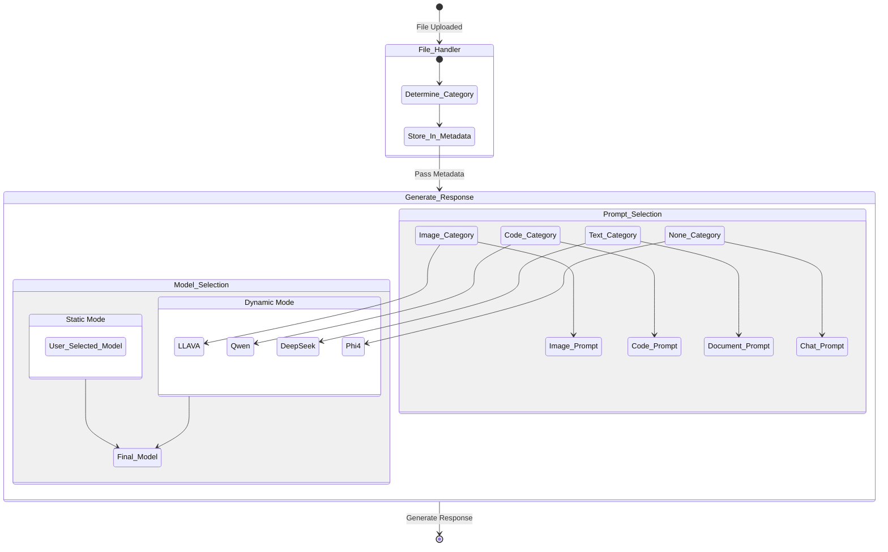

# Chainlit Chatbot with Advanced File handling, Dynamic Model Selection and Custom Prompts
This is a Web Application made using chainlit. It includes an intelligent file analysis system built with Chainlit that processes various file types and generates contextual responses using LLM. The system supports multiple file formats including images, code files, documents, and spreadsheets.


## System Architecture


## Features

- **Multi-format File Processing**: Supports various file formats including:
  - Images (JPEG, PNG)
  - Code files (Python, JSON)
  - Documents (PDF, DOCX, PPTX, TXT)
  - Spreadsheets (CSV, XLSX)


- **Context-Aware Prompting & Model Selection**: Automatically chooses the relevant prompt alongwith suitable LLM based on type of file attached.
  When a file is uploaded, the system follows these steps:

  - The FileHandler determines the category of the file (Image/Code/Text/Spreadsheets etc)
  - This category information is stored in the processed file's metadata
  - When the GenerateResponse class receives this information, it activates the appropriate LLM from the available list along with expert prompt
  - If no file attached(None category) default prompt & LLM are used





## Prerequisites

- Python 3.11+
- LLM API/ Ollama (for Open source)
- Virtual environment (recommended)

## Installation

1. Clone the repository:
```bash
git clone https://github.com/sallu-786/Chainlit_Chatbot.git
cd Chainlit_Chatbot
```

2. Create and activate a virtual environment:
```bash
python -m venv venv
source venv/bin/activate  # On Windows: venv\Scripts\activate
```

3. Install required packages:
```bash
pip install -r requirements.txt
```


2. Ensure all required dependencies are installed (see requirements.txt below)

## Usage

1. If you only need to run on your local machine, run this command:
```bash
chainlit run app.py 
```
2. IF you want to make this app accessible to to others, it needs to be served as FastAPI sub application. Use following command"
```bash
uvicorn init:app --host 0.0.0.0 --port 8000 
```
Then Open your browser and navigate to `http://localhost:8000/codepilot`


## Project Structure

```
├── app.py                    # Main application file with Chainlit setup
├── utils/
│   ├── file_handler.py       # Contains file processing and categorization logic
│   ├── generate_response.py  # Handles LLM response generation
│   ├── prompts.py            # All the prompts are defined here
├── requirements.txt          # Lists all project dependencies
├── init.py                   # For Mounting Chainlit (app) as a FastAPI sub-application

```

## Contact
For query/projects/consultancy please contact me at suleman.muhammad08@gmail.com

## License
This project is under the MIT License - Please give it a star if it helps
